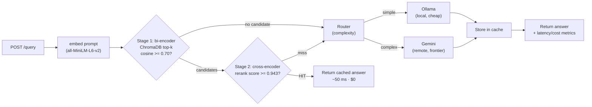
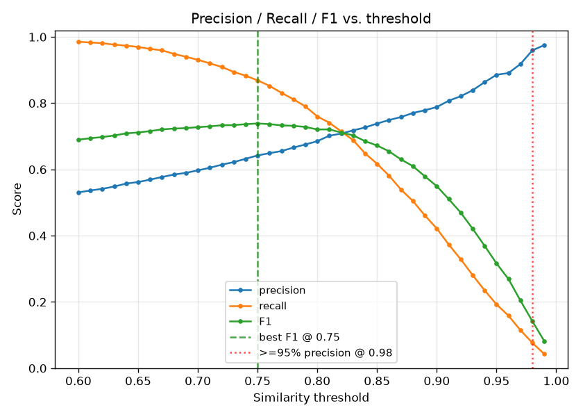
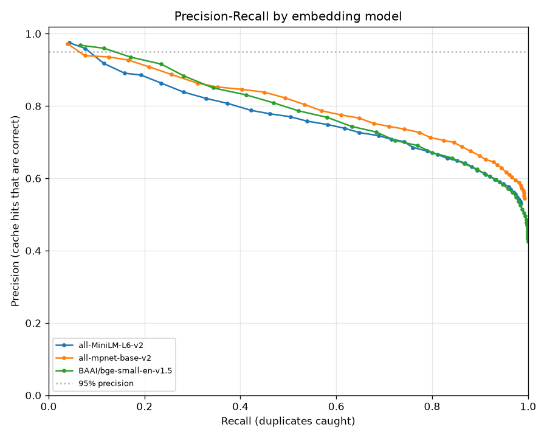
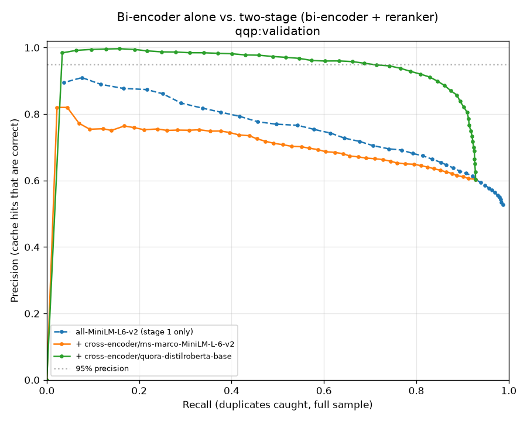

# ⚡ AI Compute Optimizer

**An LLM cost-optimization gateway — a two-stage semantic cache + model router that sits in front of your LLMs and stops you paying full price for questions you've already answered.**

<p>


</p>

## Headline numbers

| Metric | Result | Measured by |
|--------|--------|-------------|
| **Latency speedup** (cache hit vs. LLM miss) | **282×** — 14.2 s → 50 ms | [`benchmark.py`](benchmark.py) |
| **Cost reduction** vs. an all-remote gateway | **69.4%** | [`benchmark.py`](benchmark.py) |
| **Cache hit rate at 95% precision** | **44.4%** | [`eval/two_stage_eval.py`](eval/two_stage_eval.py) |
| **Projected savings** @ 100K queries/mo | **$2,636/yr** | [`eval/savings_model.py`](eval/savings_model.py) |

Every number above is reproducible from the scripts cited — not hand-waved. The precision figure is validated against **5,000 human-labeled question pairs**, and the projection labels every input `MEASURED` or `ASSUMED`.

---

## The problem

Companies pay the **full LLM API price for semantically duplicate queries**. "How do I reset my password?" and "I forgot my password, what now?" are the same question — but a naive gateway embeds each, sends both to a frontier model, and pays twice. At scale, a large fraction of production traffic is rephrasings of a small set of intents.

The obvious fix — cache answers by semantic similarity — is a trap: **a single cosine-similarity threshold cannot reliably tell "same question" from "similar-looking but different question."** Set it loose and you serve wrong answers; set it tight and you cache almost nothing. This project is about doing the caching *correctly*, and proving it.

---

## Architecture

Incoming prompt → embed → **stage-1 bi-encoder recall filter** → **stage-2 cross-encoder reranker** → cache hit (return, ~50 ms, $0) or **route** to a cheap local model / a frontier remote model.



**Why two stages?** Stage 1 (bi-encoder cosine) is fast but blunt — it encodes each prompt independently, so it's good for *recall* (cheaply narrowing millions of cached prompts to a handful of candidates) but bad for *precision*. Stage 2 (cross-encoder) reads the query and each candidate **jointly**, catching the fine distinctions that flip meaning. Tuned so stage 1 maximizes recall and stage 2 enforces 95% precision.

| Module | Responsibility |
|--------|----------------|
| [`app/main.py`](app/main.py) | FastAPI app, lifespan wiring, `/health` · `/query` · `/metrics` |
| [`app/embeddings.py`](app/embeddings.py) | Bi-encoder prompt embeddings (sentence-transformers) |
| [`app/cache.py`](app/cache.py) | **Two-stage** ChromaDB cache: cosine recall filter + rerank |
| [`app/reranker.py`](app/reranker.py) | Cross-encoder reranker (stage 2), loaded once at startup |
| [`app/router.py`](app/router.py) | Complexity heuristic → `local` / `remote` |
| [`app/llm.py`](app/llm.py) | Ollama (local) and Gemini (remote) backends |
| [`app/metrics.py`](app/metrics.py) | Latency, token-cost, and savings tracking |
| [`app/savings.py`](app/savings.py) | Shared savings-projection math (single source of truth) |
| [`app/config.py`](app/config.py) | Env-driven settings (no hardcoded keys) |

---

## The engineering story

**This is the part that matters. The headline numbers exist because the first design was wrong and I proved it, rather than shipping a plausible-looking threshold and hoping.**

### 1. I started with a hand-picked threshold — `SIMILARITY_THRESHOLD = 0.85`

Chosen the way most semantic caches are: by eyeballing a handful of prompts. It *looked* fine. That was the whole problem — it was never measured.

### 2. Validated it against 5,000 human-labeled QQP pairs — and it was indefensible

I turned the cache into what it actually is — a duplicate-question classifier — and scored it on 5,000 [Quora Question Pairs](https://huggingface.co/datasets/quora) with human duplicate/not-duplicate labels ([`eval/threshold_eval.py`](eval/threshold_eval.py)). The result: the two classes **overlap so heavily that no cosine threshold separates them**. The best-F1 operating point delivered only ~64% precision — i.e. **more than a third of cache hits would return the wrong answer.** `0.85` was a guess, and the guess was bad.



### 3. Three different bi-encoders all hit the same wall → the limit is architectural

Maybe the embedder was just weak? I benchmarked three — `all-MiniLM-L6-v2`, `all-mpnet-base-v2`, and `BAAI/bge-small-en-v1.5` — on the identical sample ([`eval/compare_models.py`](eval/compare_models.py)). **All three collapsed the same way** (class-separation gap of +0.010 to +0.026 — essentially zero). This isn't a bad model; it's a **bi-encoder architecture** limit: encoding each sentence independently destroys the distinctions that flip meaning ("how do I *learn* X" vs. "how do I *teach* X").



### 4. Two-stage retrieval fixed it: 7.7% → 68.8% recall at 95% precision, for +12 ms

A bi-encoder alone reached only **7.7% recall at 95% precision**. Adding a **cross-encoder reranker** as stage 2 — which reads both questions together — lifted that to **68.8% recall at the same 95% precision**, at a cost of ~**+12 ms** per query ([`eval/two_stage_eval.py`](eval/two_stage_eval.py)). That is the entire ballgame: ~9× more duplicate traffic captured, without lowering the precision bar.



### 5. Checked for contamination — the reranker isn't just memorizing

`cross-encoder/quora-distilroberta-base` was trained on Quora data, and GLUE QQP *is* Quora data — so a strong score could be memorization, not skill. I measured the same operating point on train vs. a held-out split ([`eval/contamination_check.py`](eval/contamination_check.py)): **QQP-train 66.8% vs. QQP-validation 68.8% — no drop.** The result generalizes across the split; it isn't recall of training pairs.

### 6. Stress-tested on PAWS — and documented where it breaks

I ran it against **PAWS**, an adversarial paraphrase set (word-swaps and entity substitutions that keep the vocabulary but invert the meaning: *"a flight from NYC to LA"* vs. *"a flight from LA to NYC"*). Precision drops — this is a **scope limitation, not contamination**. The reranker keys on lexical overlap, so entity-swapped pairs are exactly its blind spot. I did not hide this: production traffic that is adversarial in this way would need a **third tier — an LLM judge to adjudicate borderline scores, or a domain-fine-tuned reranker.**

> The selling point isn't that the first design was perfect. It's that I built the evaluation to catch my own wrong assumption, fixed it with a principled architecture, and mapped the boundary where even the fix stops working.

---

## Honest limitations

- **PAWS / adversarial inputs.** The reranker fails on entity-swapped, near-identical-vocabulary pairs (see step 6). A production deployment handling adversarial input needs a third-tier LLM judge or a fine-tuned reranker. Measured and disclosed, not hidden.
- **Local inference is modeled at $0.** The cost figures count *avoided API spend*. Self-hosted (Ollama) inference still costs GPU/compute/electricity, so the savings are optimistic as "true margin" — they're accurate as "money not sent to the API."
- **Hit rate is workload-dependent.** The 44.4% figure comes from a repetitive, benchmark-style workload. Real savings scale with how repetitive *your* traffic actually is — which is why [`eval/savings_model.py`](eval/savings_model.py) reports a full volume × hit-rate sensitivity grid instead of a single number.

---

## Tech stack

**API:** FastAPI · Pydantic · Uvicorn (async)
**Retrieval:** sentence-transformers (bi-encoder `all-MiniLM-L6-v2` + cross-encoder `quora-distilroberta-base`) · ChromaDB (cosine vector store)
**LLM backends:** Ollama (local) · Google Gemini (remote)
**Eval & ops:** pytest · Streamlit dashboard · Docker / docker-compose · HuggingFace `datasets` (QQP, PAWS)

---

## Setup & run

**Prerequisites:** Python 3.11+. Optionally [Ollama](https://ollama.com) on the host (`ollama pull llama3.2`) for the local route, and a [Gemini API key](https://aistudio.google.com/app/apikey) for the remote route.

### Local (uvicorn)

```bash
python -m venv .venv
source .venv/bin/activate          # Windows: .venv\Scripts\activate
pip install -r requirements.txt

cp .env.example .env               # then add GEMINI_API_KEY
uvicorn app.main:app --reload
```

API at <http://localhost:8000> (interactive docs at `/docs`):

```bash
curl -X POST http://localhost:8000/query \
  -H "Content-Type: application/json" \
  -d '{"prompt": "What is the capital of France?"}'
```

Send it once, then send a reworded version — the second comes back `"cache_hit": true` with the stage-1 similarity and stage-2 reranker score in the response.

### Evaluation suite

Everything in the engineering story is reproducible:

```bash
pip install -r requirements.txt -r eval/requirements.txt

python eval/threshold_eval.py   --dataset qqp --split validation --n 5000   # the wall
python eval/compare_models.py \
    sentence-transformers/all-MiniLM-L6-v2 \
    sentence-transformers/all-mpnet-base-v2 \
    BAAI/bge-small-en-v1.5 --dataset qqp                                     # 3 bi-encoders
python eval/two_stage_eval.py   --dataset qqp --split validation            # the fix
python eval/contamination_check.py                                          # train vs val vs PAWS
python eval/savings_model.py                                                # savings sensitivity grid
```

Plots and CSVs land in [`eval/results/`](eval/results/). See [`eval/README.md`](eval/README.md) for the full methodology.

### Dashboard

```bash
streamlit run dashboard.py
```

A FinOps-style view: validated headline savings, a sensitivity grid, the trust/precision story, a clearly-separated live-session panel, and an interactive query tester.

### Tests

```bash
pytest        # 28 tests: health, two-stage cache hit/miss, routing, cost model, reranker normalization
```

---

## Docker

The image installs the full stack (CPU-only PyTorch, sentence-transformers, ChromaDB) and **pre-downloads both models at build time** so startup is fast and needs no network. Secrets are injected at runtime — never baked into the image.

```bash
# Ollama runs on the HOST; the container reaches it via host.docker.internal.
export GEMINI_API_KEY=your-key-here     # optional; or put it in .env

docker compose up --build               # starts the gateway (:8000) + ChromaDB
```

```bash
docker compose ps                       # app becomes "healthy" after ~1 min
curl http://localhost:8000/health
docker compose logs -f app
```

Single container (local Chroma, no compose):

```bash
docker build -t aco-gateway .
docker run --rm -p 8000:8000 \
  --add-host host.docker.internal:host-gateway \
  -e GEMINI_API_KEY=$GEMINI_API_KEY aco-gateway
```

See the [Dockerfile](Dockerfile) for the image-size vs. startup-time tradeoff (CPU torch + baked models; `HF_HUB_OFFLINE=1` at runtime).

### Deployment modes: local+remote vs. Gemini-only

The router's local tier (Ollama) is **optional**, controlled by `ENABLE_LOCAL_ROUTE`:

| Mode | `ENABLE_LOCAL_ROUTE` | Cache-miss routing | Where it fits |
|------|----------------------|--------------------|---------------|
| **Full router** (default) | `true` | Simple prompts → **Ollama (local)**, complex → **Gemini (remote)** | Local dev & Docker, where Ollama runs on the host |
| **Gemini-only** | `false` | **Every** miss → **Gemini (remote)** | Cloud deploys with no Ollama available |

Set `ENABLE_LOCAL_ROUTE=false` and the gateway needs no local model at all — every cache miss goes to Gemini. **The two-stage semantic cache is identical in both modes**; only miss-routing changes, so cloud deploys keep the full caching/cost-saving behavior and simply lose the cheap-local tier. This is what lets the same codebase run on a cloud host (Gemini-only) and on a workstation/Docker with Ollama (full local+remote).

---

## Configuration

All settings come from environment variables — see [`.env.example`](.env.example). Key knobs:

| Variable | Default | Purpose |
|----------|---------|---------|
| `STAGE1_THRESHOLD` | `0.70` | Stage-1 cosine cut to become a rerank candidate (recall) |
| `RERANK_TOP_K` | `5` | Nearest cached prompts retrieved for reranking |
| `ENABLE_RERANKER` | `true` | Stage 2 on; `false` = bi-encoder-only (A/B) |
| `RERANKER_MODEL` | `cross-encoder/quora-distilroberta-base` | Stage-2 cross-encoder |
| `RERANKER_THRESHOLD` | `0.943` | Min reranker score to accept a hit (empirical, not a probability) |
| `COMPLEXITY_WORD_THRESHOLD` | `40` | Word count above which a prompt routes remote |
| `ENABLE_LOCAL_ROUTE` | `true` | `false` = every miss routes to Gemini (cloud, no Ollama) |
| `REMOTE_*_COST_PER_1M` | `1.50` / `9.00` | Remote price per 1M input/output tokens |
| `PROJECTED_MONTHLY_QUERIES` | `100000` | Volume assumed for the savings projection |

**Secrets are never hardcoded.** `.env` is git-ignored; only `.env.example` (blank keys) is committed.

---

## License

[MIT](LICENSE) © 2026 Barath Sanjeevan
